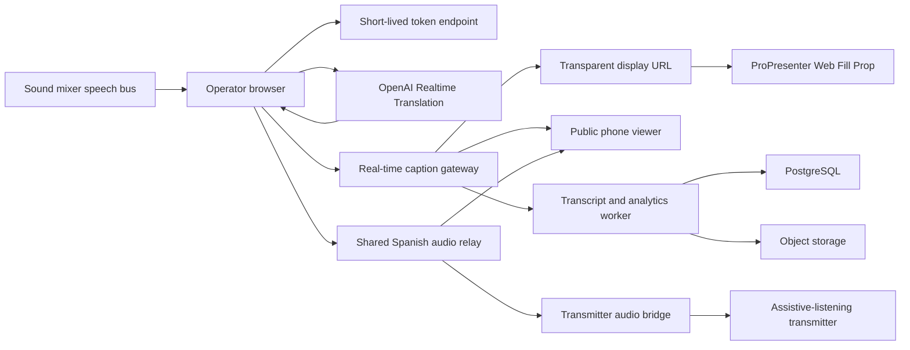

# JerichoSpeech

CaptionKit-inspired live translation platform

Master development plan — July 15, 2026

> **Implementation status — July 15, 2026:** Milestone 1 is built for local testing. The operator console, persistent `main` caption channel, transparent `/display/main` output, manual rehearsal sequence, microphone selection, audio meter, OpenAI Realtime session bridge, Spanish transcript stabilization, visibility control, and automatic caption clearing are implemented. Live speech translation is awaiting an `OPENAI_API_KEY`; the overhead screen workflow can be tested immediately in rehearsal mode. See [`overhead-caption-test-guide.md`](overhead-caption-test-guide.md).

## Executive recommendation

Build this in two distinct goals:

1. **Church pilot:** English speech in, Spanish captions out, reliable ProPresenter lower third, clean transcripts, and basic public phone viewing.
2. **Product parity:** multiple churches, teams, many languages, mobile text-to-speech, display builder, analytics, billing, APIs, Stream Deck/Companion, and broader presentation-software integrations.

Do not attempt full parity before the church pilot has survived recorded-sermon testing, a closed live rehearsal, and four supervised Sunday services. The largest product risk is not ordinary web development; it is live-audio reliability and translation quality under real sanctuary conditions.

“Clone” means clean-room feature parity. Do not copy CaptionKit source code, proprietary assets, branding, written copy, or UI pixel-for-pixel.

## Product objective

Create a church-focused platform that:

- listens to a clean speech feed from the sound mixer;
- creates English captions and real-time Spanish translations;
- publishes a transparent lower-third webpage for ProPresenter;
- gives congregation members a QR-code link for captions on their phones;
- optionally reads Spanish captions aloud using the listener's device voice;
- stores editable transcripts and basic session analytics;
- can later support many churches, languages, presentation tools, and remote-control systems.

## Recommended product shape: one language channel, many outputs

Treat Spanish as one live channel containing synchronized text and audio. Create one OpenAI translation session for that target language, then distribute its outputs to every destination. Do not create a new translation session for each listener.

```text
English soundboard audio
    -> one Spanish translation session
        -> Spanish text -> ProPresenter lower third
                        -> public phone/PWA captions
                        -> transcript/history
        -> Spanish audio -> phone/PWA listening
                         -> dedicated transmitter bridge
                         -> future livestream audio track
```

This structure keeps the text and audio aligned, prevents per-listener translation costs, and lets each destination be enabled, muted, or hidden independently.

### Output priorities

| Output | Experience | Technical path | Priority |
|---|---|---|---|
| Sanctuary screens | Two-line Spanish lower third | Transparent ProPresenter Web Fill Prop | P0 |
| Phone captions | Spanish text, adjustable size/theme | QR-linked responsive PWA over WebSockets | P1 |
| Assistive-listening transmitter | Spanish audio to RF/FM/IR hardware | Dedicated bridge page/app to selected USB or analog output | P1 |
| Phone listening | Spanish audio with captions | QR-linked PWA using a shared low-latency media relay | P1 |
| Livestream | Spanish captions and optional audio track | Browser source plus republished translated audio | P2 |
| Post-service | Source/Spanish transcript and subtitle files | Transcript history and TXT/VTT/SRT export | P1 |

### Transmitter bridge requirements

The translation computer should expose a dedicated Spanish-audio output that feeds an assistive-listening transmitter through USB or analog audio. The translated audio must never be routed into the main sanctuary PA, because its natural delay would compete with the live English speech.

The bridge should include:

- explicit output-device selection;
- persistent device assignment after restart;
- test tone and level meter;
- master mute and emergency stop;
- soft limiter to prevent sudden loud output;
- translated-audio delay/buffer health;
- automatic reconnect;
- visible `Live`, `Delayed`, `Reconnecting`, and `Muted` states;
- optional local monitoring on a separate operator headphone output.

A small desktop bridge may be more reliable than a normal browser for selecting and retaining a specific hardware audio output. The initial prototype can use the browser; production should validate output-device behavior on the exact church computer and interface.

### Phone viewer requirements

Start with a no-install PWA rather than native apps. A listener scans the church's persistent QR code, chooses Spanish, then selects `Read`, `Listen`, or `Both`. Browsers require a user gesture before audio playback, so the listener must tap a clear `Start listening` button once.

The viewer should include:

- no login requirement;
- language, text size, theme, and audio volume;
- read-only recent caption history for late joiners;
- live/reconnecting/ended status;
- low-bandwidth text-only mode;
- screen wake lock where supported;
- optional session PIN;
- one-tap audio mute without leaving captions;
- accessible controls and screen-reader labels.

The host should create one translated audio stream per language and republish it through a low-latency media relay. Phone listeners subscribe to that shared stream instead of opening individual OpenAI translation sessions.

### Operator controls for multiple destinations

Keep destination controls separate:

- show/hide overhead captions;
- start/stop public text;
- mute/unmute phone audio;
- mute/unmute transmitter audio;
- clear only the current displayed line;
- hold the last good line;
- type or correct an emergency manual caption;
- end the session for every destination.

The operator dashboard should show input audio level, translation latency, caption health, translated-audio level, transmitter state, phone listener count, and estimated session cost in one preflight/health panel.

## CaptionKit feature-parity inventory

This inventory is based on CaptionKit's public product site and help center as of July 15, 2026.

### Live capture and session control

- browser microphone, line input, USB audio interface, and virtual audio-device selection;
- audio-input permissions and input-level testing;
- NDI audio through an operating-system virtual input;
- source-language selection;
- bilingual English/Spanish source mode;
- start, stop, clear, hide, and show captions;
- “Starting soon” state;
- live source captions plus one or more translated streams;
- connection health and automatic recovery.

### Translation and caption controls

- more than 55 recognized source languages and more than 80 translation languages/dialects;
- multiple simultaneous target languages;
- interim and final caption updates;
- boosted keywords for church names, people, locations, Bible books, and uncommon terms;
- profanity filtering;
- account-defined blocked words;
- local church/theological vocabulary tuning.

### Audience access

- public browser link;
- QR code, downloadable as SVG;
- default language selection in a shared link;
- light, dark, and system themes;
- responsive font sizing;
- iOS and Android apps;
- device-based text-to-speech and selectable installed voices;
- multiple simultaneous viewers without individual accounts.

### Display outputs

- multiple named display configurations;
- unique display URLs;
- transparent background;
- scrolling lower third;
- styled single-line/subtitle output;
- full-screen captions;
- split-screen output for two to four languages;
- font size, line count, text color, background color, opacity, and top/bottom position;
- optional solid stage color for chroma keying;
- sample-text/test mode;
- ProPresenter Web Fill/Prop workflow;
- browser-source workflows for OBS, FreeShow, WorshipTools, Proclaim, and similar software;
- direct use on a smart TV or browser-connected monitor.

### History, transcripts, and analytics

- session history;
- source and translated transcripts;
- transcript download/export;
- session duration and usage accounting;
- viewer counts and basic engagement history;
- organization-level reporting.

### Team, account, and billing

- church/organization account and public handle;
- multiple team members;
- organization roles;
- usage entitlements for caption hours and simultaneous translations;
- subscription and payment management;
- API key creation and revocation;
- account settings and data retention controls.

### Automation and integrations

- authenticated HTTPS API;
- commands/signals for start, stop, clear, hide, show, starting-soon on/off, and language selection;
- GET and POST command support;
- Bitfocus Companion module and generic HTTP compatibility;
- Stream Deck control through Companion;
- ProPresenter-triggered actions through RossTalk on Mac;
- ProPresenter-triggered actions through MIDI on Windows and Mac;
- integration documentation and troubleshooting.

## Scope decisions

### Pilot scope

The first deployable version is for one church and includes:

- English-US source audio;
- Spanish target translation;
- Chrome/Edge operator console;
- soundboard/USB audio selection and meter;
- start, stop, clear, hide, and show;
- two-line transparent lower third;
- persistent ProPresenter Web Fill URL;
- public Spanish viewer link and QR code;
- keyword glossary;
- saved English and Spanish transcripts;
- one admin account;
- health indicator, reconnection, and error logging.

### Not in the pilot

- native mobile apps;
- subscription billing;
- many organizations;
- 80+ target languages;
- full display designer;
- Companion module;
- RossTalk/MIDI automation;
- cloud-generated translated audio;
- audio recording;
- automatic Scripture-version substitution.

These belong in later phases after the core service is reliable.

## Recommended technology stack

### Repository and language

- TypeScript monorepo;
- pnpm workspaces and Turborepo;
- strict TypeScript, ESLint, Prettier, and shared schemas;
- GitHub repository with protected `main`, preview deployments, and automated checks.

### Web applications

- **Next.js:** operator dashboard, organization administration, public caption pages, display editor, transcript history, billing, and documentation;
- **React:** live controls and display components;
- **Tailwind CSS plus accessible headless components:** product UI without copying CaptionKit's design;
- **Web Audio API and AudioWorklet:** input meter, device selection, audio-state monitoring, and future raw-audio processing;
- **OpenAI Realtime Translation over WebRTC:** direct continuous speech translation during the pilot.

### Real-time backend

- **Node.js with Fastify:** session API, authorization, caption ingest, usage metering, and integration endpoints;
- **WebSockets:** low-latency operator/display/viewer events;
- **Redis:** optional when the system grows past one real-time process; used for pub/sub, presence, rate limits, and ephemeral session state;
- **background worker:** transcript finalization, exports, analytics aggregation, emails, and billing reconciliation.

Do not run the live WebSocket/audio system as short-lived serverless functions. It needs persistent connections and predictable process lifetime.

### Speech and translation

- **First provider: OpenAI `gpt-realtime-translate`.** It uses a dedicated streaming-translation endpoint and returns translated transcript deltas plus translated audio while source audio is still arriving.
- **Transport:** use WebRTC when the operator browser captures the soundboard audio. Use a server-side WebSocket media worker later when one translated audio stream must be republished to many listeners.
- **Provider adapter:** all speech events enter an internal schema so OpenAI can later be benchmarked against Azure, Google, Deepgram plus a translation model, or another provider without rewriting the product.
- **Initial language pair:** English source audio to Spanish (`es`) output. OpenAI requires one translation session per target language.
- **Browser access:** the server creates a short-lived translation client secret; the permanent OpenAI API key is never shipped to the browser.
- **Text-to-speech:** `gpt-realtime-translate` already returns translated audio. For the initial caption-only pilot, ignore that audio. For mobile listening, either republish one translated OpenAI audio stream per language or use native iOS/Android voices as the lower-cost fallback.
- **Glossary strategy:** keep application-level exact replacements and blocked terms. Benchmark high-value names and theological vocabulary because the dedicated translation guide does not promise that arbitrary glossary instructions will always be followed.

### Data and storage

- **PostgreSQL:** organizations, memberships, sessions, caption segments, translations, displays, public links, glossary terms, API keys, usage ledger, and subscriptions;
- **S3-compatible object storage:** transcript exports, QR assets, and optional future audio recordings;
- **encrypted secrets:** platform secret manager, never database plaintext;
- **default policy:** store text transcripts; do not store source audio unless an organization explicitly enables recording.

### Authentication, payments, and communications

- **Auth.js:** email magic links and optional Google login backed by PostgreSQL;
- **Stripe Billing:** subscriptions, usage add-ons, invoices, and customer portal when the product becomes multi-church;
- **Resend or equivalent:** login emails, team invitations, usage alerts, and session failure alerts;
- **hashed API keys:** one-way stored credentials with prefixes for identification and per-key scopes.

### Mobile applications

- **Expo React Native:** one shared iOS/Android codebase;
- **native device text-to-speech:** local, fast, and usually free;
- **WebSocket session client:** live captions, selected language, font controls, light/dark mode, and reconnect;
- **deep links/QR:** open a church and session directly in the installed app, falling back to the browser.

### Hosting and operations

- **Railway Pro:** persistent web, real-time, worker, PostgreSQL, Redis, and object storage for the early production system;
- **Cloudflare:** DNS, CDN, WAF, rate limiting, and caching for static/public display assets;
- **Sentry:** frontend/backend error reporting and release tracking;
- **OpenTelemetry-compatible logs and metrics:** session start failures, speech-provider errors, reconnects, event latency, and usage discrepancies;
- **GitHub Actions:** tests, type checks, database migration checks, and deployment gates.

Railway is preferred for the first production deployment because the real-time service needs persistent WebSockets. At higher scale, session relay can move to regional services or Cloudflare Durable Objects without changing the client contract.

## Reference architecture



### Live event contract

Every caption event should use one internal schema:

```json
{
  "sessionId": "...",
  "segmentId": "...",
  "sequence": 42,
  "sourceLanguage": "en-US",
  "targetLanguage": "es",
  "kind": "partial",
  "text": "Porque por gracia...",
  "sourceText": "For by grace...",
  "startedAtMs": 123400,
  "endedAtMs": 126100,
  "revision": 3,
  "createdAt": "..."
}
```

`partial` events can change. `final` events become transcript records and should not be rewritten without an explicit edit operation.

## Caption stabilization

Raw interim translation will visibly rewrite itself. A dedicated stabilizer is therefore a first-class product component.

The stabilizer should:

- keep a stable prefix and a mutable tail;
- only replace the current segment, never previously finalized segments;
- wait briefly for clause boundaries when meaning would otherwise reverse;
- split long finalized text into readable lines based on measured display width;
- limit the main lower third to two lines;
- retain the preceding final line while the next line is forming;
- clear after a configurable silence interval;
- attach monotonically increasing sequence and revision numbers;
- let reconnecting clients request a state snapshot before consuming new deltas.

This logic is product IP and should be tested separately from the speech provider.

## Core data model

- `organizations`: church name, handle, timezone, defaults, retention;
- `users` and `memberships`: account, role, organization access;
- `sessions`: state, source language, targets, timestamps, provider, duration;
- `caption_segments`: ordered source partial/final records and timing;
- `translated_segments`: target-language text and revisions;
- `glossary_terms`: boosted, replacement, or blocked term rules;
- `displays`: layout type, language, typography, colors, lines, position;
- `public_links`: handle/token, theme, default language, optional PIN;
- `viewer_events`: anonymous session joins, language, device class, heartbeat;
- `api_keys`: prefix, hash, scopes, last use, revocation;
- `usage_ledger`: billable speech seconds, target count, provider cost estimate;
- `subscriptions`: Stripe customer, plan, entitlements, status;
- `exports`: transcript format, storage path, status, expiry;
- `audit_events`: administrative and integration actions.

## Development roadmap

### Phase 0 — Audio and provider benchmark: 1–2 weeks

Deliverables:

- collect ten representative sermon/announcement recordings;
- obtain direct soundboard audio, not camera or room audio;
- compare OpenAI Realtime Translation against representative sermon audio and retain Azure as a fallback benchmark;
- create the Spanish theological/local-name glossary;
- define bilingual human-review scorecard;
- verify ProPresenter Web Fill transparency on the exact production computer and output path.

Exit criteria:

- median final translation latency below 3.5 seconds on clean speech;
- bilingual reviewers score meaning at least 4/5 on 90% of evaluated segments;
- no show-stopping Web Fill or network restriction on the production system.

### Phase 1 — Single-church pilot: 4–6 weeks

Deliverables:

- admin login;
- operator page with input selector, meter, source/target, start/stop/clear/hide;
- OpenAI short-lived translation client-secret endpoint;
- continuous English-to-Spanish translation;
- caption stabilizer;
- WebSocket real-time gateway;
- transparent two-line ProPresenter display URL;
- public Spanish browser page and QR code;
- transcript persistence and TXT/VTT export;
- glossary controls;
- session logs and health panel;
- automated unit, integration, and reconnect tests.

Exit criteria:

- one 90-minute session without manual restart;
- p50 translated-display latency at or below 3 seconds and p95 at or below 5 seconds;
- reconnect restores current caption state within five seconds;
- no permanent OpenAI API key reaches browser code;
- four supervised Sunday services completed with documented issues.

### Phase 2 — Church-ready web product: 5–7 additional weeks

Deliverables:

- multi-organization isolation;
- role-based team membership;
- multi-language target selection;
- multiple named display configurations;
- scrolling, styled, full-screen, and split-screen displays;
- full display editor and preview/test text;
- public-link theme/language controls and SVG QR downloads;
- history, editable transcripts, SRT/VTT/TXT exports;
- viewer and usage analytics;
- keyword boosting, replacement rules, profanity and blocked-word management;
- usage limits and alerts;
- backup, retention, deletion, and audit features.

Exit criteria:

- no cross-organization data access in automated security tests;
- 100 concurrent caption viewers for one session with no missed final segments;
- all display types verified in current ProPresenter and OBS;
- usage ledger remains within 1% of provider-billed duration.

### Phase 3 — Automation and commercial operations: 4–6 additional weeks

Deliverables:

- versioned public API and scoped API keys;
- start/stop/clear/hide/show/pending/language signals;
- webhook events for session and health state;
- Bitfocus Companion module submission;
- Stream Deck workflow;
- ProPresenter RossTalk and MIDI recipes;
- Stripe plans, checkout, invoices, customer portal, and entitlements;
- team invitations and transactional email;
- support/admin console for failed sessions, usage corrections, and refunds.

Exit criteria:

- integration commands are idempotent and auditable;
- revoked API keys fail immediately;
- Stripe webhook replay cannot double-credit or double-charge usage;
- ProPresenter actions can start, clear, and stop a session in rehearsal.

### Phase 4 — Native audience apps: 6–9 additional weeks

Deliverables:

- Expo iOS and Android apps;
- QR/deep-link church joining;
- language, font, theme, and voice controls;
- device-based text-to-speech with queue control;
- reconnect, session-end, and stale-caption behavior;
- accessibility testing with VoiceOver and TalkBack;
- App Store and Play Store releases.

Exit criteria:

- caption-to-device-speech delay remains acceptable during a full sermon;
- TTS does not speak superseded partial captions;
- app recovers after phone lock, Wi-Fi change, and temporary network loss;
- store review and privacy disclosures are complete.

### Phase 5 — Full-parity hardening: 3–5 additional weeks

Deliverables:

- provider failover or fast manual provider switching;
- load and soak testing;
- formal incident runbooks and status page;
- cost dashboards and spend limits;
- organization export/deletion workflow;
- threat model, dependency audit, and penetration-test remediation;
- data-processing agreement and published retention/privacy policy if sold externally;
- support documentation for major audio and presentation workflows.

## Overall schedule and staffing

### One experienced full-stack engineer, aided by Codex

- usable single-church pilot: approximately 5–8 weeks including real rehearsals;
- strong web product: approximately 12–18 weeks total;
- broad CaptionKit-like parity including mobile, billing, and integrations: approximately 5–8 months.

### Focused three-person team

- product/full-stack lead;
- real-time/backend engineer;
- frontend/mobile engineer;
- part-time bilingual QA/church production reviewer.

With parallel work, broad parity is approximately 4–6 months. Calendar time cannot be compressed to ordinary website speed because Sunday rehearsals, app-store review, audio-device testing, and translation evaluation are sequential constraints.

## Development cost

These are replacement-cost estimates if outside engineering were hired. They are not the cash cost when Codex and an internal operator do the implementation.

| Delivery level | Effort | At $100/hour | At $150/hour |
|---|---:|---:|---:|
| Single-church pilot | 200–320 hours | $20,000–$32,000 | $30,000–$48,000 |
| Church-ready web product | 600–900 cumulative hours | $60,000–$90,000 | $90,000–$135,000 |
| Broad feature parity | 1,200–1,800 cumulative hours | $120,000–$180,000 | $180,000–$270,000 |

A product agency carrying design, management, QA, mobile release, and support overhead could price full parity around $200,000–$400,000.

If Codex builds this with Ryan as product owner and church tester, the immediate cash outlay is primarily cloud usage, hardware, domain, and app-store accounts. The engineering replacement-cost numbers still matter because they show the amount of product, QA, and maintenance being undertaken.

## Operating cost model

OpenAI currently lists `gpt-realtime-translate` at **$0.034 per source-audio minute**, or **$2.04 per hour for one target language**. Each additional target language needs another translation session, so translation cost scales approximately linearly by target language. The model returns translated audio and transcript deltas at that duration-based rate.

### Single-church pilot

| Item | Expected cost |
|---|---:|
| Railway production baseline | $20–$40/month |
| OpenAI translation, 4 speech hours, one target | about $8.16/month |
| OpenAI translation, 8 speech hours, one target | about $16.32/month |
| Email, monitoring, backups | $0–$30/month initially |
| Domain | approximately $15–$30/year |
| Apple developer account, if mobile launches | $99/year; eligible nonprofits may request a waiver |
| Google Play account, if mobile launches | $25 one time |

Expected web-pilot total:

- **four speech hours/month:** approximately **$30–$80/month**;
- **eight speech hours/month:** approximately **$35–$90/month**.

### Example multi-church scale

These examples assume an average of eight billable speech hours per church per month and one target language.

| Scale | Speech hours | Speech estimate | Infrastructure/tools | Estimated total |
|---|---:|---:|---:|---:|
| 10 churches | 80 | $163 | $80–$250 | $245–$415/month |
| 25 churches | 200 | $408 | $150–$450 | $560–$860/month |
| 100 churches | 800 | $1,632 | $400–$1,300 | $2,030–$2,930/month |

The main cost driver is translated speech time, not caption viewers. Text WebSocket traffic and transcript storage are comparatively small. Support labor, taxes, and payment-processing fees are not included. Stripe's current standard domestic-card rate is 2.9% plus $0.30 per successful payment.

### Hardware

- if the mixer already provides a usable USB output: possibly $0 beyond a cable;
- basic isolated USB audio interface plus cabling: approximately $100–$250;
- optional dedicated translation computer: approximately $500–$1,000;
- wired Ethernet adapter/cabling: approximately $20–$60.

Use an isolated mixer output to avoid ground-loop hum and to control exactly which microphones reach the caption engine.

## Quality and testing strategy

### Translation evaluation

Create a fixed corpus containing:

- normal sermon pacing;
- fast and emotional preaching;
- Scripture quotations;
- names and local place names;
- theological terms;
- multiple speakers;
- audience response and applause;
- quiet speech;
- accidental music leakage.

Have fluent Spanish reviewers score:

- meaning preserved;
- theological meaning preserved;
- names and Scripture references;
- natural Spanish;
- unacceptable or misleading error;
- end-to-end latency.

Word-error rate alone is not sufficient because a grammatically different Spanish translation can still preserve the meaning.

### Automated testing

- unit tests for caption revisions, stability, line breaking, filters, and metering;
- recorded-audio integration tests against the speech provider;
- WebSocket ordering, loss, duplicate, and reconnect tests;
- multi-organization authorization tests;
- end-to-end operator-to-display tests in real browsers;
- load tests for viewers and concurrent sessions;
- 90–120 minute soak tests;
- migration and backup-restore drills;
- mobile offline/lock/network-change tests.

### Production rehearsals

- replay a recorded sermon through the actual soundboard path;
- closed rehearsal on the sanctuary screens;
- supervised live pilot with a bilingual reviewer;
- manual Clear button always available;
- written fallback: remove the ProPresenter Prop, keep the English service running, and offer a human summary if translation fails.

## Security, privacy, and legal boundaries

- obtain speaker awareness/consent for transcription;
- store no audio by default;
- encrypt traffic and storage;
- hash API keys and scope every integration credential;
- isolate every organization in application authorization and database queries;
- make public links revocable, rate-limited, and optionally PIN-protected;
- publish retention and deletion controls;
- do not present machine translation as a qualified interpreter for counseling, legal, financial, immigration, medical, or safeguarding conversations;
- use a clean-room feature design and original product identity.

## Principal risks and mitigations

| Risk | Mitigation |
|---|---|
| Bad room audio | Dedicated mixer speech bus, USB interface, meter, rehearsals |
| Caption rewrites/flicker | Stable-prefix caption algorithm and final-segment contract |
| Theological mistranslation | Phrase list, replacement glossary, bilingual scorecard, human disclaimer |
| Internet loss | Visible operator health, reconnection, state snapshots, documented fallback |
| Provider price/quality change | Provider adapter, benchmark corpus, usage ledger |
| ProPresenter Web Fill issue | Test exact version; keep native Message API or OBS browser source as fallback |
| Unexpected cloud bill | Per-organization limits, alerts, hard caps, session auto-stop |
| Mobile TTS speaking corrections | Speak finalized segments only and maintain a cancellable queue |
| Cross-church data exposure | Organization-scoped authorization tests and audit logs |
| Overbuilding before ministry validation | Four-Sunday gate before multi-tenant/mobile investment |

## First 30 development days

### Week 1

- select the product name and new repository location;
- capture ten clean sermon samples;
- create an OpenAI API project with a restricted key, budget, and spend alerts;
- benchmark English-to-Spanish translation;
- define quality scorecard and glossary;
- test a transparent local webpage in ProPresenter.

### Week 2

- scaffold monorepo, database, authentication, and deployment;
- implement audio-device selection and level meter;
- implement provider token endpoint and continuous translation spike;
- define caption event schema.

### Week 3

- implement WebSocket session gateway;
- implement caption stabilizer;
- build lower-third display and operator controls;
- add session health, logs, and reconnect snapshots.

### Week 4

- persist transcripts;
- add glossary controls and public Spanish viewer;
- create QR code and export;
- run recorded-sermon and 90-minute soak tests;
- deploy to a staging URL and rehearse on the production ProPresenter computer.

## Go/no-go gates

Do not begin each later investment until the prior gate is satisfied:

1. **Build gate:** direct soundboard audio and ProPresenter Web Fill both work.
2. **Pilot gate:** bilingual quality and latency meet the Phase 0 threshold.
3. **Church-ready gate:** four live services complete without a critical failure.
4. **SaaS gate:** at least three churches agree to pilot and have distinct language needs.
5. **Mobile gate:** real users request spoken translations often enough to justify app-store maintenance.

## Recommended immediate decision

Approve Phase 0 plus Phase 1 only. That creates an owned English-to-Spanish church pilot without committing to the multi-month parity build. The architecture is deliberately compatible with the entire parity roadmap, so pilot work is not thrown away.

## Current source references

### CaptionKit surface

- [CaptionKit product features and pricing](https://captionkit.com/)
- [CaptionKit supported languages](https://docs.captionkit.io/en/articles/11080883-supported-languages)
- [CaptionKit audio inputs](https://docs.captionkit.io/en/articles/10171044-setting-up-your-audio-input)
- [CaptionKit displays](https://docs.captionkit.io/en/articles/10171946-setting-up-displays)
- [CaptionKit scrolling lower thirds](https://docs.captionkit.io/en/articles/12163223-scrolling-lower-thirds)
- [CaptionKit full-screen and split-screen displays](https://docs.captionkit.io/en/articles/11113883-full-screen-displays)
- [CaptionKit public links and QR codes](https://docs.captionkit.io/en/articles/10172622-public-caption-links)
- [CaptionKit keyword controls](https://docs.captionkit.io/en/articles/10172671-keywords)
- [CaptionKit ProPresenter integration](https://docs.captionkit.io/en/articles/10172499-using-captionkit-in-propresenter)
- [CaptionKit automation signals](https://docs.captionkit.io/en/articles/10172993-signals)
- [CaptionKit Bitfocus Companion integration](https://docs.captionkit.io/en/articles/10391856-using-bitfocus-companion)
- [CaptionKit device text-to-speech approach](https://docs.captionkit.io/en/articles/10307802-adding-more-voices-for-text-to-speech-on-ios)

### Proposed stack and costs

- [OpenAI Realtime Translation](https://developers.openai.com/api/docs/guides/realtime-translation)
- [OpenAI `gpt-realtime-translate` model](https://developers.openai.com/api/docs/models/gpt-realtime-translate)
- [OpenAI API pricing](https://developers.openai.com/api/docs/pricing#audio-tokens)
- [OpenAI Realtime cost management](https://developers.openai.com/api/docs/guides/realtime-costs)
- [Azure real-time speech translation fallback](https://learn.microsoft.com/en-us/azure/ai-services/speech-service/how-to-translate-speech)
- [Railway pricing](https://docs.railway.com/pricing)
- [Stripe pricing](https://stripe.com/pricing)
- [Apple Developer membership](https://developer.apple.com/support/compare-memberships/)
- [Google Play developer registration](https://support.google.com/googleplay/android-developer/answer/6112435)
